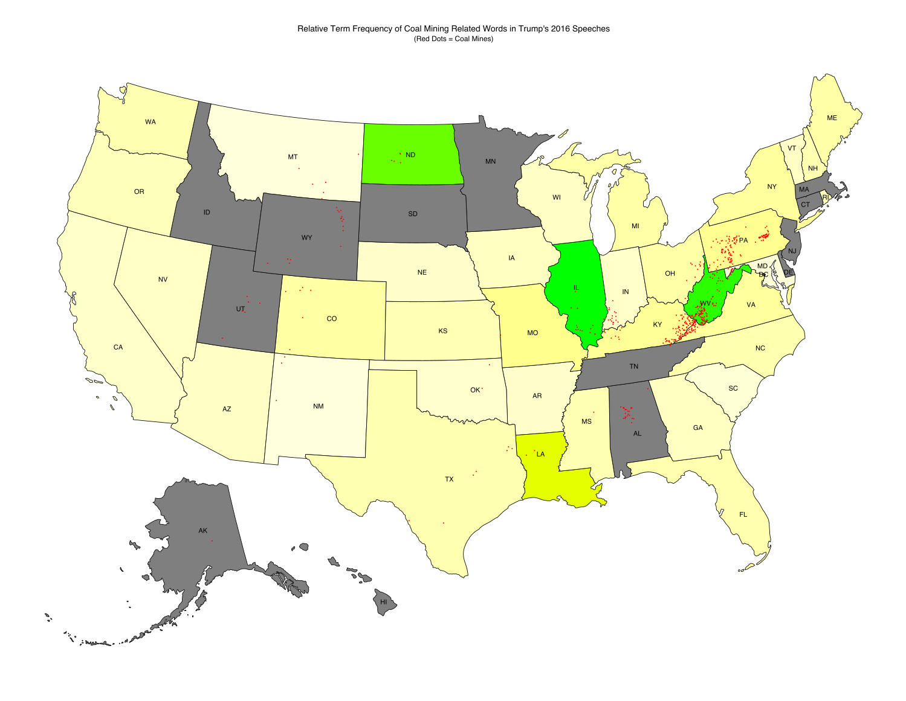

# trump-speeches
By applying a Latent Dirichlet Allocation (LDA) topic model to Trump's speeches during his 2016 campaign, we can investigate whether his language usage varied depending on the location of his speeches. This analysis shows that there is a correlation between the relative frequency of coal mining related terms in Trump's speeches and the number of coal mines in the respective state, suggesting that Trump tailored his message to address the concerns and issues of the audience in each location.

